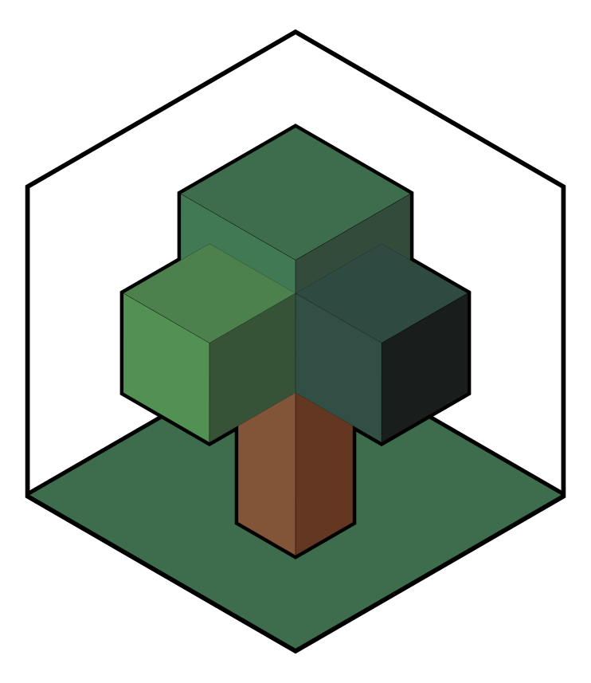

# allometric <a href="https://brycefrank.com/allometric/"></a>

<!-- badges: start -->

[](https://github.com/brycefrank/allometric/actions/workflows/check-standard.yaml)
[](https://github.com/brycefrank/allometric)
[](https://codecov.io/gh/brycefrank/allometric)
<!-- badges: end -->

`allometric` is an R package for predicting tree attributes with
allometric models. Thousands of allometric models exist in the
scientific and technical forestry literature, and `allometric` is a
platform for archiving and using this vast array of models in a robust
and structured format.

`allometric` not only enables the use of allometric models for analysis,
it also provides a structured language for adding models to the package.
If you are interested in helping the developer in this process please
refer to the [Installing a
Model](https://brycefrank.com/allometric/articles/installing_a_model.html)
vignette.

In total **`allometric` contains 1604 models across 48 publications**,
the following table displays the number of models by continent and
category:

| category          |  AS |  EU |  NA |  AF |  OC |  SA |
|:------------------|----:|----:|----:|----:|----:|----:|
| biomass component |  26 | 136 | 435 |   0 |   0 |   0 |
| site index        |   0 |   0 |  14 |   0 |   0 |   0 |
| stem height       |   7 |   0 | 105 |  12 |   2 |  18 |
| stem volume       |   4 |   0 | 575 |   0 |   0 |  20 |
| stump volume      |   0 |   0 |  64 |   0 |   0 |   0 |
| taper             |   2 |   0 |  18 |   0 |   0 |   0 |
| tree biomass      |   2 |  36 |  90 |   0 |  21 |  16 |
| other             |   0 |   0 | 125 |   0 |   0 |   0 |

Refer to the
[Reference](https://brycefrank.com/allometric/reference/index.html) for
a full list of publications disaggregated by allometric model type.

## How Can I Help?

`allometric` is a monumental undertaking, and already several people
have come forward and added hundreds of models. There are several ways
to help out. The following list is ranked from the least to most
difficult tasks.

1.  [Add missing publications as an
    Issue](https://github.com/brycefrank/allometric/issues/new?assignees=brycefrank&labels=add+publication&template=add-models-from-a-publication.md&title=%5BInsert+Author-Date+Citation%5D).
    We always need help *finding publications* to add. If you know of a
    publication that is missing, feel free to add it as an Issue and we
    will eventually install the models contained inside.
2.  [Find source material for a
    publication](https://github.com/brycefrank/allometric/labels/missing%20source).
    Some publications are missing their original source material.
    Usually these are very old legacy publications. If you know where a
    publication might be found, or who to contact, leave a note on any
    of these issues.
3.  [Help us digitize
    publications](https://github.com/brycefrank/allometric/issues?q=is%3Aissue+is%3Aopen+label%3A%22digitization+needed%22).
    We always need help *digitizing legacy reports*, at this link you
    will find a list of reports that need manual digitization. These can
    be handled by anyone with Excel and a cup of coffee.
4.  [Learn how to install and write
    models](https://brycefrank.com/allometric/articles/installing_a_model.html).
    Motivated users can learn how to install models directly using the
    package functions and git pull requests. Users comfortable with R
    and git can handle this task.

Other ideas? Contact <bfrank70@gmail.com> to help out.

## Installation

Currently `allometric` is only available on GitHub, and can be installed
using `devtools`.

``` r
devtools::install_github("brycefrank/allometric")
```

## Getting Started

Most users will only be interested in finding and using allometric
equations in their analysis. `allometric` allows rapid searching of
currently installed models.

Before beginning, make sure to install the models locally by running

``` r
library(allometric)
install_models()
```

This compiles the allometric models, and enables their use.
`install_models()` only needs to be ran at installation or following any
package updates. After running this function, the models are available
in the variable `allometric_models`. Refer to the `?allometric_models`
help for more information.

``` r
head(allometric_models)
```

    #> # A tibble: 6 × 12
    #>   id       model_type   country   region    family       genus  species    model      pub_id        family_name covt_name pub_year
    #>   <chr>    <chr>        <list>    <list>    <chr>        <chr>  <chr>      <list>     <chr>         <list>      <list>       <dbl>
    #> 1 cd71c0b8 stem height  <chr [1]> <chr [3]> Accipitridae Circus canadensis <FxdEffcM> hahn_1984     <chr [1]>   <chr [4]>     1984
    #> 2 7bc0e06a stem volume  <chr [1]> <chr [3]> Accipitridae Circus canadensis <FxdEffcM> hahn_1984     <chr [1]>   <chr [2]>     1984
    #> 3 1fa4219a stem volume  <chr [1]> <chr [3]> Accipitridae Circus canadensis <FxdEffcM> hahn_1984     <chr [1]>   <chr [2]>     1984
    #> 4 b359d3ce stump volume <chr [1]> <chr [3]> Accipitridae Circus canadensis <FxdEffcM> hahn_1984     <chr [1]>   <chr [1]>     1984
    #> 5 fb5c4575 stem ratio   <chr [1]> <chr [3]> Accipitridae Circus canadensis <FxdEffcM> hahn_1984     <chr [1]>   <chr [1]>     1984
    #> 6 218a0299 stem volume  <chr [1]> <chr [1]> Aceraceae    Acer   <NA>       <FxdEffcM> brackett_1977 <chr [1]>   <chr [2]>     1977

**Finding and Selecting a Model**

`allometric_models` is a `tibble::tbl_df` dataframe. Each row represents
one allometric model with various attributes. Some columns are `list`
columns, which are columns that contain lists with multiple values as
their elements. One example of this is the `family_name` column, which
contains the names of all authors for the publication that contains the
model.

`list` columns enable rigorous searching of models covered in the
`?allometric_models` help page, but to get started we will use a helper
function called `unnest_models()` that will give us a clearer picture of
the available data. Using the `cols` argument we can specify which
columns we want to unnest. In this case we will unnest the `family_name`
column.

``` r
unnested_models <- unnest_models(allometric_models, cols = "family_name")
unnested_models
```

    #> # A tibble: 3,760 × 12
    #>    id       model_type   country   region    family       genus       species     model      pub_id        family_name covt_name pub_year
    #>    <chr>    <chr>        <list>    <list>    <chr>        <chr>       <chr>       <list>     <chr>         <chr>       <list>       <dbl>
    #>  1 cd71c0b8 stem height  <chr [1]> <chr [3]> Accipitridae Circus      canadensis  <FxdEffcM> hahn_1984     Hahn        <chr [4]>     1984
    #>  2 7bc0e06a stem volume  <chr [1]> <chr [3]> Accipitridae Circus      canadensis  <FxdEffcM> hahn_1984     Hahn        <chr [2]>     1984
    #>  3 1fa4219a stem volume  <chr [1]> <chr [3]> Accipitridae Circus      canadensis  <FxdEffcM> hahn_1984     Hahn        <chr [2]>     1984
    #>  4 b359d3ce stump volume <chr [1]> <chr [3]> Accipitridae Circus      canadensis  <FxdEffcM> hahn_1984     Hahn        <chr [1]>     1984
    #>  5 fb5c4575 stem ratio   <chr [1]> <chr [3]> Accipitridae Circus      canadensis  <FxdEffcM> hahn_1984     Hahn        <chr [1]>     1984
    #>  6 218a0299 stem volume  <chr [1]> <chr [1]> Aceraceae    Acer        <NA>        <FxdEffcM> brackett_1977 Brackett    <chr [2]>     1977
    #>  7 6321e7d1 stem height  <chr [1]> <chr [3]> Altingiaceae Liquidambar styraciflua <FxdEffcM> hahn_1984     Hahn        <chr [4]>     1984
    #>  8 f3698bb3 stem volume  <chr [1]> <chr [3]> Altingiaceae Liquidambar styraciflua <FxdEffcM> hahn_1984     Hahn        <chr [2]>     1984
    #>  9 14d46395 stem volume  <chr [1]> <chr [3]> Altingiaceae Liquidambar styraciflua <FxdEffcM> hahn_1984     Hahn        <chr [2]>     1984
    #> 10 07cbe95e stump volume <chr [1]> <chr [3]> Altingiaceae Liquidambar styraciflua <FxdEffcM> hahn_1984     Hahn        <chr [1]>     1984
    #> # … with 3,750 more rows

Now, each row represents unique data combinations for each model, which
can be quickly filtered by most users using `dplyr::filter`. For
example, to find a volume model for the genus Alnus that had
`"Brackett"` as an author or co-author we can use

``` r
brackett_alnus_vol <- unnested_models %>%
  dplyr::filter(
    family_name == "Brackett", model_type == "stem volume",
    genus == "Alnus"
  )

brackett_alnus_vol
```

    #> # A tibble: 1 × 12
    #>   id       model_type  country   region    family     genus species model      pub_id        family_name covt_name pub_year
    #>   <chr>    <chr>       <list>    <list>    <chr>      <chr> <chr>   <list>     <chr>         <chr>       <list>       <dbl>
    #> 1 f21028ef stem volume <chr [1]> <chr [1]> Betulaceae Alnus rubra   <FxdEffcM> brackett_1977 Brackett    <chr [2]>     1977

we can see that model `f21028ef` is a volume model written by Brackett
for *Alnus rubra*. The model can be selected using the `id` field:

``` r
brackett_alnus_mod <- brackett_alnus_vol %>% select_model("f21028ef")
```

or by using the row index

``` r
brackett_alnus_mod <- brackett_alnus_vol %>% select_model(1)
```

**Determine Needed Information**

`brackett_alnus_mod` now represents an allometric model that can be used
for prediction.

Using the standard output of `brackett_alnus_mod` we obtain a summary of
the model form, the response variable, the needed covariates and their
units, a summary of the model descriptors (i.e., what makes the model
unique within the publication), and estimates of the parameters.

``` r
brackett_alnus_mod
```

    #> Model Call: 
    #> vsia = f(dsob, hst) 
    #>  
    #> Model Form: 
    #> vsia = 10^a * dsob^b * hst^c 
    #>  
    #> vsia [ft3]: volume of the entire stem inside bark, including top and stump
    #> dsob [in]: diameter of the stem, outside bark at breast height
    #> hst [ft]: total height of the stem
    #> 
    #> Parameter Estimates: 
    #> # A tibble: 1 × 3
    #>       a     b     c
    #>   <dbl> <dbl> <dbl>
    #> 1 -2.67  1.92  1.07
    #> 
    #> Model Descriptors: 
    #> # A tibble: 1 × 7
    #>   country region family     genus species geographic_region age_class
    #>   <chr>   <chr>  <chr>      <chr> <chr>   <chr>             <chr>    
    #> 1 US      US-WA  Betulaceae Alnus rubra   <NA>              <NA>

We can see from the `Model Call` section that `brackett_alnus_mod` will
require two covariates called `dsob`, which refers to diameter outside
bark at breast height, and `hst`, the height of the main stem.

**Predict Using the Selected Model**

Using the `predict()` method we can easily use the function as defined
by providing values of these two covariates.

``` r
predict(brackett_alnus_mod, 12, 65)
```

    #> 22.2347 [ft^3]

or we can use the prediction function with a data frame of values

``` r
my_trees <- data.frame(dias = c(12, 15, 20), heights = c(65, 75, 100))
predict(brackett_alnus_mod, my_trees$dias, my_trees$heights)
```

    #> Units: [ft^3]
    #> [1] 22.23470 39.80216 94.20053

or even using the convenience of `dplyr`

``` r
my_trees %>%
  mutate(vols = predict(brackett_alnus_mod, dias, heights))
```

    #>   dias heights            vols
    #> 1   12      65 22.23470 [ft^3]
    #> 2   15      75 39.80216 [ft^3]
    #> 3   20     100 94.20053 [ft^3]

## Next Steps

The following vignettes available on the [package
website](https://brycefrank.com/allometric/index.html) provide
information to two primary audiences.

Users interested in finding models for analysis will find the following
documentation most useful:

- [Common Inventory Use
  Cases](https://brycefrank.com/allometric/articles/inventory_example.html)
- `?allometric_models`

Users interested in **contributing models** to the package will find
these vignettes the most useful:

- [Installing a
  Model](https://brycefrank.com/allometric/articles/installing_a_model.html)
- [Describing a Model with
  Descriptors](https://brycefrank.com/allometric/articles/descriptors.html)
- [Variable Naming
  System](https://brycefrank.com/allometric/articles/variable_naming_system.html)
